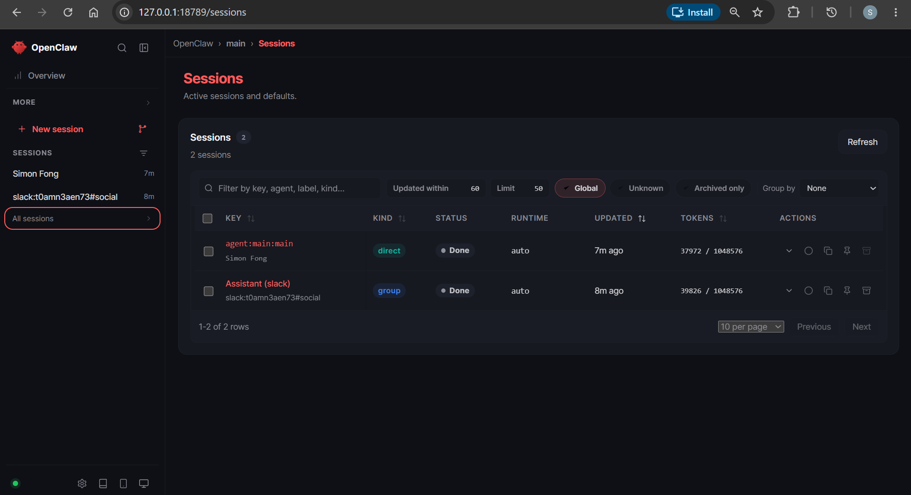
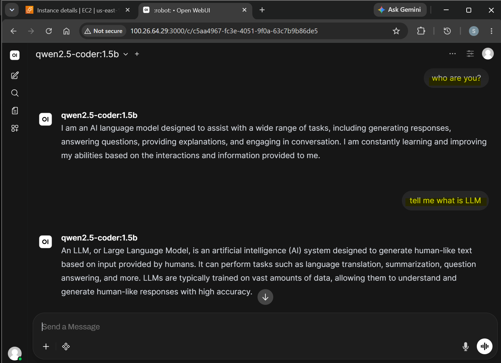
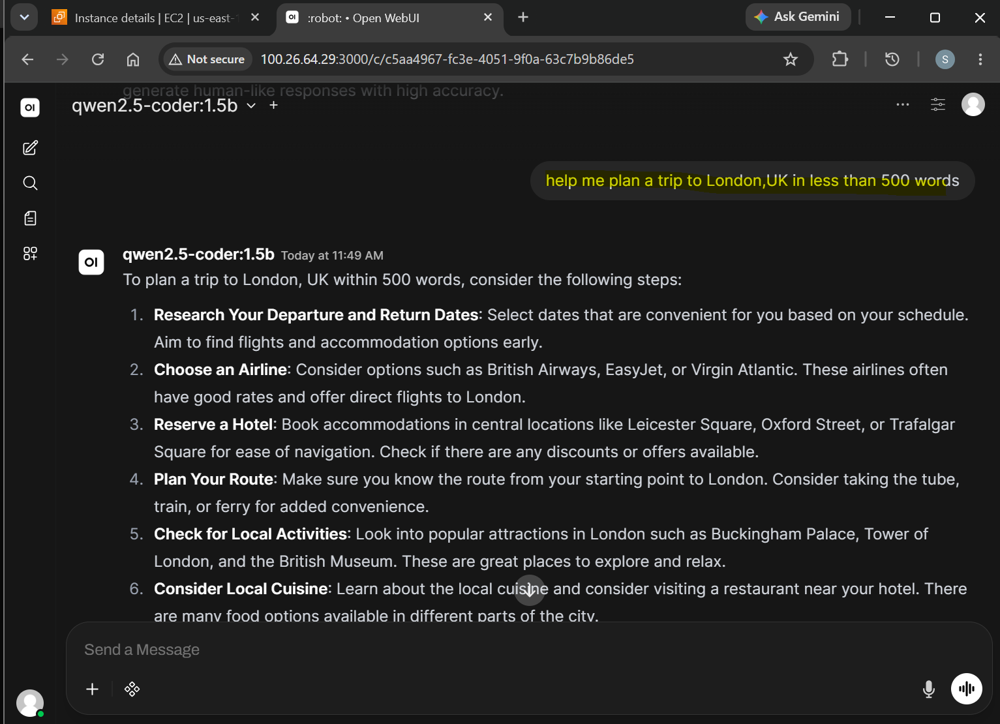
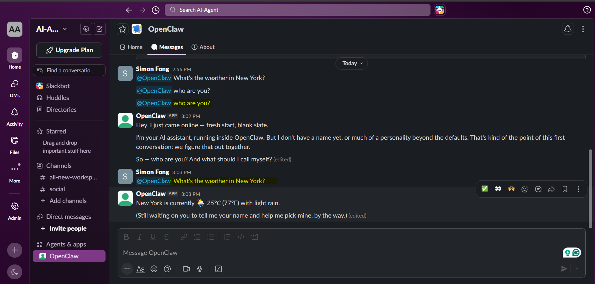

# Openclaw

- Openclaw

- OpenUI

- Slack

---

## Documentation

- [via Docker](./docs/01-docker.md)
- [AWS EC2 GPU](./docs/02-aws-migration.md)
- [via K8s](./docs/03-k8s-kind.md)
- [via WSL](./docs/04-wsl.md)
